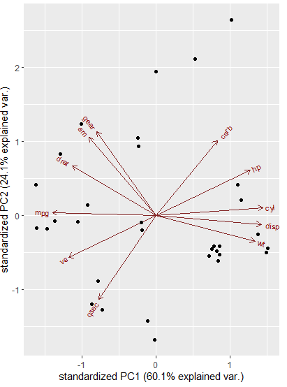
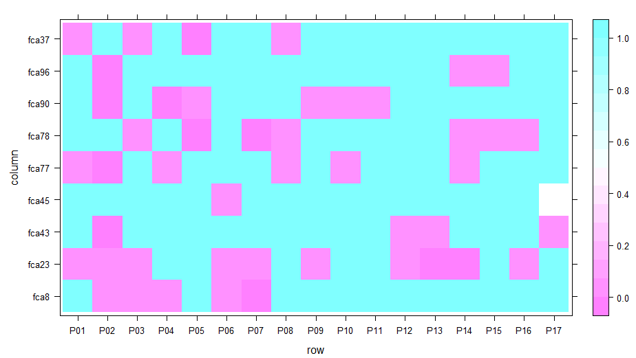
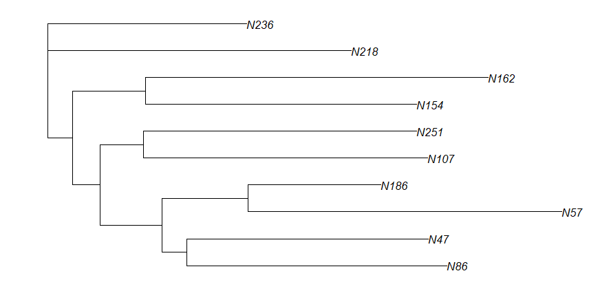

```{r, include = FALSE}
library(knitr)
knitr::opts_chunk$set(
  collapse = TRUE,
  comment = "#>"
)
library(PopGenAnalysis)
```

## Introduction

`PopGenAnalysis` is an R package to view various different plots for different types of population genomic data such as PCA plots for data sets of populations with different numerical attributes, HWE plots, etc.

see `help(package = "PopGenAnalysis")` for more information and references provided by `citation("PopGenAnalysis")`

To download **PopGenAnalysis** , use the following commands:

``` r
require("devtools")
devtools::install_github("Heffley/PopGenAnalysis"，build_vignettes = TRUE)
library(PopGenAnalysis)
```

To list all functions available in this package:

```r
ls("package:PopGenAnalysis")
```

<br>

## Components
There are 3 functions in the package:

The __*pcaPopulationPlot*__ allows users to input the chromosome name and gene range as arguments, then returns the summary for all transcripts within the input range, with information of gene name, transcript 

The __*hwHeatPlot*__ function generates the plot heatmap showing significant departures from HWE where the pink values are where p are less than or equal to alpha.

The __*provestiDistDendo*__ will display a dendogram of random n individuals/populations to visualize  a genetic distance with a given data set.

All the functions should be straightforward to use, as long as the valid data sets are used.

The following example illustrate how to use __*pcaPopulationPlot*__ function: 

```r
pcaPopulationPlot(mtcars)
```
The following PCA plot should appear. 

<div style="text-align:center">
<div style="text-align:left">

The following example illustrate how to use __*hwHeatPlot*__ function: 
```r
hwHeatPlot(nancycats, 100, 0.05)
```

The following heatmap should appear. 

<div style="text-align:center">
<div style="text-align:left">


The following example illustrate how to use __*provestiDistDendo*__ function: 

```r
provestiDistDendo(nancycats, 10)
```

A dendogram should appear, results may vary, as population is randomly picked from data set.

<div style="text-align:center">
<div style="text-align:left">

## Package References

[Chen, J. (2021) PopGenAnalysis (Different Plots for Population Genomic Data): an R package for
  plotting Population Genomic Data.
](https://github.com/Heffley/PopGenAnalysis)

<br>

## Other References

Hadley Wickham, Romain François, Lionel Henry and Kirill Müller (2021). dplyr: A Grammar of Data
  Manipulation. R package version 1.0.7. https://CRAN.R-project.org/package=dplyr
  
Jombart, T. (2008) adegenet: a R package for the multivariate analysis of genetic markers.
  Bioinformatics 24: 1403-1405. doi: 10.1093/bioinformatics/btn129

Jombart T. and Ahmed I. (2011) adegenet 1.3-1: new tools for the analysis of genome-wide SNP
  data. Bioinformatics. doi: 10.1093/bioinformatics/btr521

Kamvar ZN, Tabima JF, Grünwald NJ. (2014) Poppr: an R package for genetic analysis of
  populations with clonal, partially clonal, and/or sexual reproduction. PeerJ 2:e281. doi:
  10.7717/peerj.281

Kamvar ZN, Brooks JC and Grünwald NJ (2015) Novel R tools for analysis of genome-wide population
  genetic data with emphasis on clonality. Front. Genet. 6:208. doi: 10.3389/fgene.2015.00208

Paradis E. & Schliep K. 2019. ape 5.0: an environment for modern phylogenetics and evolutionary
  analyses in R. Bioinformatics 35: 526-528
  
Paradis E. 2010. pegas: an R package for population genetics with an integrated-modular
  approach. Bioinformatics 26: 419-420.

Sarkar, Deepayan (2008) Lattice: Multivariate Data Visualization with R. Springer, New York.
  ISBN 978-0-387-75968-5

Vincent Q. Vu (2011). ggbiplot: A ggplot2 based biplot. R package version 0.55.
  http://github.com/vqv/ggbiplot


----

```{r}
sessionInfo()
```
